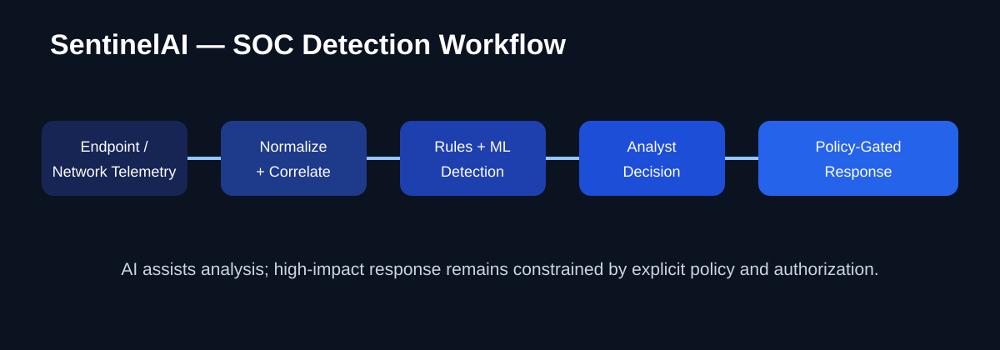

# SentinelAI

## AI-Assisted SOC & Threat Detection Platform

**SentinelAI** is an experimental cybersecurity platform exploring endpoint and network telemetry, rule-based detection, machine-learning assistance, threat intelligence, event correlation, and policy-gated response workflows.

> **Project status:** Experimental / portfolio project. Integrations must be independently verified and hardened before production use.

### Security workflow

**Telemetry → normalization → detection → correlation → analyst decision → policy-gated response**

### Detection areas

- Windows Event Logs / Sysmon
- Linux audit and system logs
- Zeek / Suricata telemetry
- Sigma-style rules
- YARA-oriented analysis
- Behavioral and anomaly detection
- Multi-event correlation
- Threat-intelligence enrichment

### AI / ML role

- Isolation Forest anomaly detection
- Supervised classification
- Local LLM-assisted analysis
- Automated incident-summary assistance

AI output is **analyst assistance**, not authoritative evidence.

### Response safety

High-impact actions such as endpoint isolation, process termination, firewall changes, or IP blocking should follow:

**DETECTED → TRIAGED → POLICY CHECK → AUTHORIZED → EXECUTED → VERIFIED → AUDITED**

Automated response should be disabled by default and constrained by explicit policy, allowlists, authorization, and audit logging.

See docs/RESPONSE_SAFETY.md and SECURITY.md.

### Security hardening

- Inject secrets through deployment-time secret management.
- Restrict CORS to trusted origins.
- Enforce authorization on administrative endpoints.
- Keep threat-intelligence credentials out of source control.
- Isolate high-impact response actions behind explicit policy gates.

### My role

**Hassan Faris — Cybersecurity Engineer | SOC | Network Security**

Focused on detection workflow design, security telemetry, correlation, AI-assisted analysis, and safe response architecture.

### Links

- GitHub: https://github.com/faris7assan
- LinkedIn: https://www.linkedin.com/in/hassan-faris
- Portfolio: https://hassanhamedfaris69.base44.app

### Authorized-use notice

Use endpoint telemetry collection, network monitoring, and response capabilities only in environments where you have explicit authorization.
