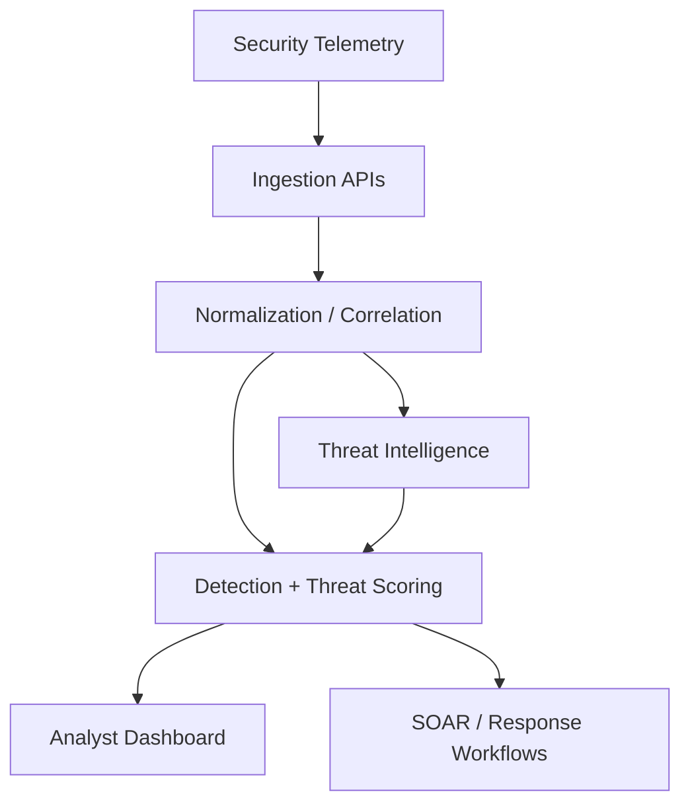

# SentinelAI Portfolio Architecture

## Security Boundary

SentinelAI should be treated as a portfolio/research platform unless every integration is independently hardened and validated for production use.

## Hardening Priorities

- Supply JWT secrets through deployment-time secret management and fail closed when absent.
- Restrict CORS to trusted application origins.
- Protect account provisioning and administrative operations with explicit authorization checks.
- Keep OAuth, database, cloud, and threat-intelligence credentials outside source control.
